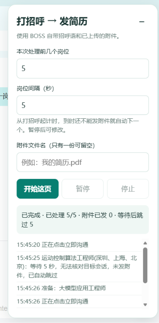

# BOSS 两步助手


面向 Edge / Chrome 的本地浏览器扩展。在用户已登录 BOSS 直聘后，按职位页中已加载的岗位依次执行：

1. 使用 BOSS 自带招呼语发起沟通；
2. 在符合平台会话条件时，发送用户已上传到 BOSS 的指定附件简历；
3. 达到可配置等待时间后仍不能发送，则记录原因并处理下一个岗位。

当前版本：`0.1.1`。

## 界面预览

运行面板：



收起后显示为页面右下角的“两步助手”按钮：


## 本地安装

1. 打开 `edge://extensions/` 或 `chrome://extensions/`；
2. 开启开发者模式；
3. 点击“加载解压缩的扩展”，选择 `extension` 文件夹；
4. 刷新已登录的 BOSS 职位页面。

详细操作、更新方法和运行边界见 [使用说明](使用说明.md)。

## 开发验证

```powershell
npm install
npm test
```

## 目录

- `extension/`：浏览器扩展源码
- `tests/`：核心逻辑和模拟页面测试
- `docs/`：调研与设计资料

## 权利声明

Copyright © 2026 唐英昊。保留所有权利。

本仓库未授予复制、修改、分发或商业使用许可。如需使用或购买，请先取得作者书面授权。
