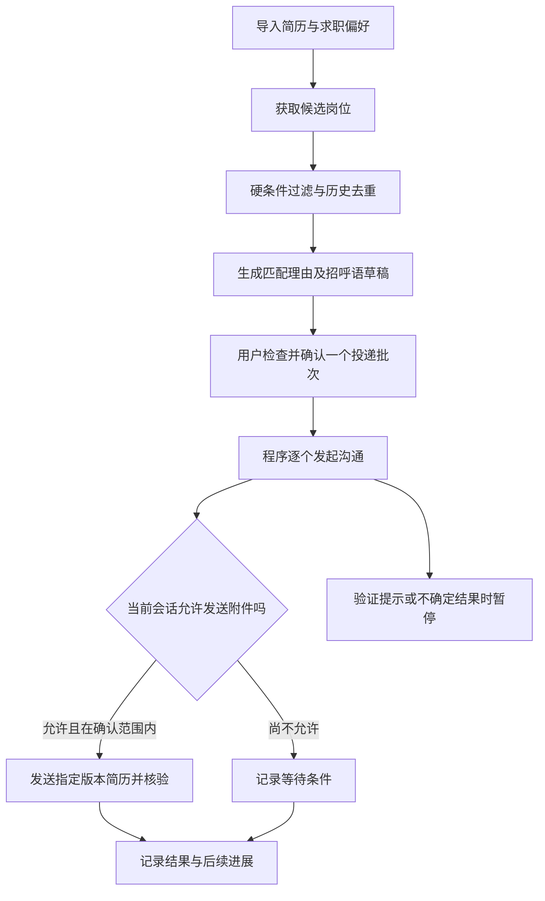

**BOSS 直聘求职自动化：调研、方案比较与推荐设计**

调研日期：2026-09-07。当前范围：研究与设计，尚未开发程序、登录账号或进行实际投递。

建议面向个人自用，优先开发 Windows 本地可视化程序，以 Python、FastAPI、Playwright、SQLite 组成最小系统。先验证当前网页的可操作性，再实现筛选、匹配、批次审核、顺序执行与记录。AI 用于理解岗位和生成文案；发送流程由可检查的程序规则控制。

**证据范围与关键发现。** 以下“常见路线”归纳自公开项目和厂商文档，不代表经过市场份额统计的行业排名。项目 README 中的功能属于作者声明，本次没有对这些仓库做完整代码审计，也没有用真实账号验证其当前可用性。搜索摘要可能落后于仓库当前说明，本文优先采用打开后的页面内容。

1. 技术上已有多种实现，但页面变化和访问限制会使已有程序失效。`boss_batch_push` 当前 README 明确表示未适配新版职位页面，并引导用户迁移至 `ai-job`。[原项目说明](https://github.com/yangfeng20/boss_batch_push)
2. `get_jobs` 是关注度较高的参考项目，本次页面显示约 8.3k Star；但 README 同时列出 BOSS 投递过程中反复刷新的问题。因此关注度不能证明现在能稳定使用。[项目说明](https://github.com/loks666/get_jobs)
3. “投递”需要拆分定义：发起沟通、发送招呼语、发送简历附件、对方已读、收到回复是不同状态。官方可访问的协议页面中，隐私政策的在线沟通部分说明附件简历交换涉及双方的发起与同意；实际入口与条件仍要以当前账号页面为准。[官方协议及隐私政策](https://www.zhipin.com/web/common/protocol/protocol-2019-09-30.html)
4. 本次没有查到面向普通求职者、可公开申请使用的官方投递 API。检索到的 BossHi 开发文档针对 BossHi 应用接入，不能据此认定它提供 BOSS 直聘求职投递能力。[BossHi 文档](https://histatic.zhipin.com/front/bosshi-mp-docs/client/web/guide/basic.html)
5. 官方可访问的用户协议第四部分第 8 条限制未经许可通过第三方工具获取服务，列举了浏览职位、收发简历等行为。本文引用的页面路径带有历史日期，未确认它是否是当前账号接受的最新版本；低频、人工审核和本地运行均不能证明获得了平台许可。[官方协议第四部分](https://www.zhipin.com/web/common/protocol/protocol-2019-09-30.html)

**常见实现路线。** 表中的取舍属于基于工具机制和公开项目的工程判断。

| 路线 | 实现方法与代表资料 | 优点 | 主要代价 | 本项目判断 |
| --- | --- | --- | --- | --- |
| 油猴脚本／浏览器扩展 | 在已登录页面加入控制面板，读取页面元素并执行操作；[boss_batch_push](https://github.com/yangfeng20/boss_batch_push)、[Chrome 内容脚本文档](https://developer.chrome.com/docs/extensions/develop/concepts/content-scripts) | 贴近原有使用习惯，适合轻量工具 | 页面适配、标签页状态、后台任务恢复需要维护；旧脚本可能失效 | 适合作为备选交互形式 |
| 独立浏览器自动化 | 程序控制浏览器，搜索、读详情、填写、点击；[get_jobs](https://github.com/loks666/get_jobs)、[boss-zhipin-bot](https://github.com/as161233574-alt/boss-zhipin-bot) | 容易集中管理状态、日志、匹配与多版本简历 | 要安装运行环境；浏览器页面和平台限制需要实测 | 推荐作为本地程序第一版 |
| 通用 RPA | 录制和编排网页操作；[Power Automate 官方文档](https://learn.microsoft.com/en-us/power-automate/desktop-flows/automation-web) | 适合已经熟悉 RPA 的人快速做固定流程 | 复杂匹配、恢复和版本维护仍需要开发；若依赖物理坐标，还需处理窗口条件 | 可用于概念验证，不作为首选底座 |
| 非公开接口／协议调用 | 调用网站内部请求，或解析其通讯协议；[boss-auto-hunter](https://github.com/jiaxiangjun202315310204/boss-auto-hunter)、[ai-job](https://github.com/yangfeng20/ai-job) | 能直接处理结构化数据，减少页面操作 | 缺少官方接口契约，字段、鉴权及协议变化增加维护负担 | 不作为第一版依赖 |

AI Agent／MCP 是叠加在执行工具之上的决策或接入层，不是另一种稳定的投递通道。例如 `boss-agent` 采用 Playwright、FastMCP 等提供搜索和投递工具；它仍然依赖底层网站操作。[项目说明](https://github.com/Douyh123/boss-agent)

**值得参考的项目及当前注意点。**

| 项目 | 本次查到的能力与现状 | 适合参考什么 |
| --- | --- | --- |
| [loks666/get_jobs](https://github.com/loks666/get_jobs) | Java／JDK 21、ChromeDriver，多平台、AI 匹配和图片简历；README 提示 BOSS 投递刷新问题 | 多平台适配、过滤配置、历史记录；当前版本不能直接视为可用成品 |
| [yangfeng20/boss_batch_push](https://github.com/yangfeng20/boss_batch_push) | 批量沟通和招呼语；当前明确未适配新版页面 | 轻量交互思路，避免直接从旧教程安装后就运行 |
| [yangfeng20/ai-job](https://github.com/yangfeng20/ai-job) | 前端油猴脚本配合 Spring Boot 后端；README 公告原服务器计划于 2026 年 4 月左右关停，AI 功能需其他服务或自行部署 | 浏览器内界面和后端分工；本次没有验证公告所述服务器实际状态 |
| [as161233574-alt/boss-zhipin-bot](https://github.com/as161233574-alt/boss-zhipin-bot) | 声明使用 FastAPI、Playwright、SQLite、Vue，具备搜索评分、多简历和记录面板 | 最接近本次推荐的产品结构；不等于已经验证其可靠性 |
| [yeatssc/boss-auto-apply](https://github.com/yeatssc/boss-auto-apply) | 声明支持多格式简历、候选人画像、匹配、DrissionPage 与 nodriver 双引擎 | 简历素材管理与匹配流程；双引擎也意味着需要维护更多组件 |

若二次开发，需按实际采用版本检查许可证。`get_jobs` 当前 LICENSE 是自定义非商业许可；个人工具与后续收费产品的选型条件不同。[许可证原文](https://github.com/loks666/get_jobs/blob/main/LICENSE)

**我建议的产品设计。** 下面是本项目建议，不是已经实现或经过效果验证的功能。

用户首次在专用浏览器窗口中完成登录。程序呈现候选表格：公司、岗位、薪资原文、地点、匹配理由、疑点、已沟通情况和拟发送内容。用户可以修改文案、排除岗位、指定简历版本，并确认这一批的执行范围；同一批不需要逐条弹窗。若岗位、文案或附件发生实质变化，重新进入待检查状态。

规则筛选先处理城市、岗位方向、最低薪资、经验、学历、公司排除名单和不接受的工作条件。未知字段保留为“待核实”。月薪、日薪、年薪、额外薪资月数分别保存，不直接按数字大小混合比较；“薪资面议”也不能推导为低薪或高薪。外包、出差等条件需结合语境，避免把“不涉及外包”错误剔除。

AI 输出结构化的匹配结果，包括符合项、不符合项、缺失信息和依据。每条依据应指向简历中的真实经历或岗位原文。排序分数只是启发式指标，不代表录用概率；阈值用用户审核过的样本校准。第一版可先使用规则加固定模板，使没有模型服务时仍能工作。

简历使用“事实素材库＋多个经用户检查的版本”。生成招呼语时挑选相关经历，不添加没有依据的年限、项目成绩或技能。附件在批次中绑定版本与文件摘要，防止用户切换当前简历后，队列误发另一个文件。图片简历应作为明确选择的独立形式，不能计为原生附件发送成功。

执行器应通过站点适配模块操作页面，把岗位匹配逻辑与网页选择器分开。优先试用 Playwright，因为其官方能力包含操作前等待、元素可操作性检查和操作轨迹查看，方便诊断页面变化；这些能力并不保证 BOSS 放行自动化。[自动等待](https://playwright.dev/python/docs/actionability)、[轨迹查看](https://playwright.dev/python/docs/trace-viewer)

先用专用浏览器数据目录保存登录状态，避免操作日常浏览器主目录。Playwright 官方文档支持持久上下文，并提醒不要直接自动化默认 Chrome 用户目录。[持久上下文文档](https://playwright.dev/python/docs/api/class-browsertype#browser-type-launch-persistent-context)

**建议加入的工程机制。**

| 机制 | 具体行为 | 解决的问题 |
| --- | --- | --- |
| 分步记录 | 分开记录准备、执行中、沟通已确认、附件待发送、附件已确认、失败、结果未知 | 不把点击按钮等同于完成投递 |
| 防止重复执行 | 对账号、岗位、招聘者和动作类型建立操作记录；发送前持久化意图 | 程序重启后避免重复打招呼 |
| 不确定结果处理 | 点击后超时先核对会话；无法确认时暂停，不自动补发 | 降低已发送但未记账导致的重复消息 |
| 单一浏览器执行队列 | 同时只执行一个有外部影响的动作；解析和评分可独立运行 | 避免多个任务切换标签导致发错人 |
| 双层去重 | 岗位级别避免重复处理，招聘者／会话级别避免重复开场；公司级规则由用户设定 | 同公司多个岗位既不盲目全禁，也不连续重复联系 |
| 人工接管 | 识别验证、限额提示、登录失效、页面结构异常后停下并展示原因 | 防止脚本在错误状态继续点击 |
| 批次范围固定 | 绑定具体岗位、招呼语、附件版本和允许动作 | 避免审核完成后内容悄悄变化 |
| 本地数据控制 | 简历、记录、登录目录优先存本机；模型仅接收必要字段；密钥不进入页面和普通日志 | 减少个人资料暴露 |

不预设“每天多少次绝对安全”或“随机延迟就不会封号”。任务数量上限用于控制本次工作量，遇到平台显示的限制立即停止。薪资承诺、到岗时间、面试确认及联系方式交换应有独立的用户设置或人工处理，不由自由对话模型自行决定。外部岗位和聊天文本只作为数据，不允许其修改执行规则。

**三个可选方案。**

| 方案 | 组成 | 适合情况 | 我的排序 |
| --- | --- | --- | --- |
| Windows 本地可视化程序 | Python＋FastAPI＋SQLite＋Playwright；本机网页控制台，后续可打包启动器 | 希望长期使用，管理筛选、简历版本、投递记录与异常 | 首选 |
| Chrome／Edge 扩展＋本地辅助服务 | 扩展负责页面交互，本地服务负责模型、文件和历史 | 更重视在当前浏览器中操作，接受扩展安装与维护 | 第二选择；可复用核心业务模块 |
| 离线匹配与文案助手 | 用户粘贴岗位信息，自动匹配、排序、生成文案，由用户在原站发送 | 需要减少平台自动交互依赖，或者网页适配尚未通过验证 | 可独立交付的基础模式 |

本地程序可先用普通网页界面，不必第一天引入复杂桌面壳、多账号、云端托管、多 Agent 或向量数据库。未来是否增加这些组件，应由已经出现的需求决定。AI 服务费用取决于选用模型与实际输入输出量，本次没有做成本或面试转化率的实测。

**开发顺序与验收依据。**

1. 页面可行性验证：在用户指定账号与当前网站版本上确认登录、列表、详情、发起沟通及原生附件流程；对必须真实发送的验证，先明确测试对象与内容。若页面访问受限，保留离线模式，不把绕过验证当作功能前提。
2. 只读原型：实现偏好、简历文本、岗位候选、硬过滤、去重、解释和导出；这一阶段不发消息。用月薪／日薪混合、字段缺失、否定表达、同公司多岗位等样本检查筛选结果。
3. 执行原型：加入固定批次、单队列、暂停继续及持久记录。用本地模拟页面验证重复启动、点击后断网、页面变更、附件不允许发送、登录过期等情况。
4. 小范围真实验收：按用户指定范围核对每一步结果，分别统计沟通成功与附件成功。不能用“按钮点击没有报错”作为成功标准。
5. 再增加 AI 匹配、文案、多版本简历和进度分析；观察有效回复、有效面试及误投情况，判断功能是否值得继续扩展。

进入开发时需要确定目标城市与岗位、薪资和排除条件、使用的简历版本，以及自动执行的范围。这些信息不影响当前技术方案比较；本轮按用户选择完成调研与设计，待决定路线后再开发。
